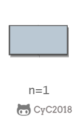
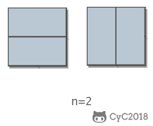

# 10.2 矩形覆盖

[NowCoder](https://www.nowcoder.com/practice/72a5a919508a4251859fb2cfb987a0e6?tpId=13&tqId=11163&tPage=1&rp=1&ru=/ta/coding-interviews&qru=/ta/coding-interviews/question-ranking)

## 题目描述

我们可以用 $2*1$ 的小矩形横着或者竖着去覆盖更大的矩形。请问用 $n$ 个 $2*1$ 的小矩形无重叠地覆盖一个 $2*n$ 的大矩形，总共有多少种方法？

<div align="center">  </div><br>

## 解题思路

当 $n$ 为 $1$ 时，只有一种覆盖方法：

<div align="center">  </div><br>

当 $n$ 为 $2$ 时，有两种覆盖方法：

<div align="center">  </div><br>

要覆盖 $2*n$ 的大矩形，可以先覆盖 $2*1$ 的矩形，再覆盖 $2*(n-1)$ 的矩形；或者先覆盖 $2*2$ 的矩形，再覆盖 $2*(n-2)$ 的矩形。而覆盖 $2*(n-1)$ 和 $2*(n-2)$ 的矩形可以看成子问题。该问题的递推公式如下：

$$f(n)=\left\{\begin{array}{ll}
1 && n=1 \\
2 && n=2 \\
f(n-1)+f(n-2) && n>1
\end{array}\right.$$

```python
# -*- coding:utf-8 -*-
class Solution:
    def rectCover(self, number):
        # write code here
        if number <=2: return number
        a, b = 1, 2
        for _ in range(3, number+1):
            a, b = b, a + b
        return b
```
