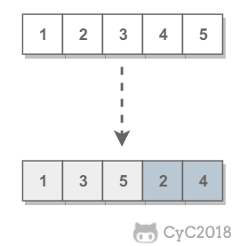

# 21. 调整数组顺序使奇数位于偶数前面

[LeetCode](https://leetcode-cn.com/problems/diao-zheng-shu-zu-shun-xu-shi-qi-shu-wei-yu-ou-shu-qian-mian-lcof/submissions/)

## 题目描述

需要保证奇数和奇数，偶数和偶数之间的相对位置不变，这和书本不太一样。

<div align="center">  </div><br>

### 解题思路


```python
class Solution:
    def exchange(self, nums: List[int]) -> List[int]:
        i, j = 0, len(nums)-1
        while i < j:
            if nums[i] % 2 == 1:
                i += 1
            else:
                nums[i], nums[j] = nums[j], nums[i]
                j -= 1
        return nums
```
