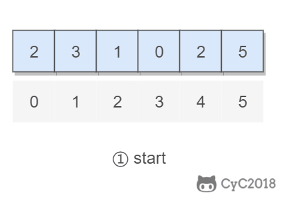

# 3. 数组中重复的数字

[LetCode](https://leetcode-cn.com/problems/shu-zu-zhong-zhong-fu-de-shu-zi-lcof/)

## 题目描述

在一个长度为 n 的数组里的所有数字都在 0 到 n-1 的范围内。数组中某些数字是重复的，但不知道有几个数字是重复的，也不知道每个数字重复几次。请找出数组中任意一个重复的数字。

```html
Input:
{2, 3, 1, 0, 2, 5}

Output:
2
```

## 解题思路

要求时间复杂度 O(N)，空间复杂度 O(1)。因此不能使用排序的方法，也不能使用额外的标记数组。

对于这种数组元素在 [0, n-1] 范围内的问题，可以将值为 i 的元素调整到第 i 个位置上进行求解。

以 (2, 3, 1, 0, 2, 5) 为例，遍历到位置 4 时，该位置上的数为 2，但是第 2 个位置上已经有一个 2 的值了，因此可以知道 2 重复：




```python
class Solution:
    def findRepeatNumber(self, nums: List[int]) -> int:
        if len(nums) < 2:
            return False

        for num in nums:
            if num < 0 or num > len(nums) - 1:
                return Flase

        for index, num in enumerate(nums):
            while num != index:
                if nums[num] == num:
                    return num
                else:
                    nums[index], nums[num] = nums[num], nums[index]
        return  False
```

### 扩展的题目二

```python
class Solution:
    def findRepeatNumber(self, nums):
        if len(nums) < 2:
            return False

        for num in nums:
            if num < 0 or num > len(nums) - 1:
                return Flase

        start, end = 1, len(nums) - 1
        while start <= end:
            middle = (start + end) >> 1
            counts = self.countRange(nums, start, middle)
            if start == end:
                if counts > 1:
                    return start
                else:
                    break
            
            if counts > middle - start + 1:
                end = middle
            else:
                start = middle + 1
        return False
                
    @staticmethod
    def countRange(nums, start, end):
        """
        统计　nums 中在　[start, end] 区间内的元素数目
        """
        sums = 0
        for num in nums:
            if start <= num <= end:
                sums += 1
        return sums

```