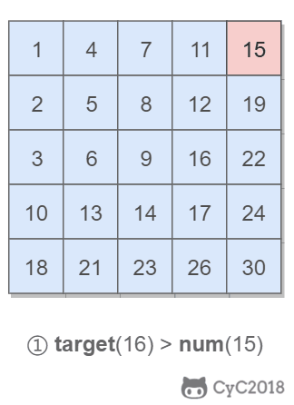

# 4. 二维数组中的查找

[LetCode](https://leetcode-cn.com/problems/er-wei-shu-zu-zhong-de-cha-zhao-lcof/)

## 题目描述

给定一个二维数组，其每一行从左到右递增排序，从上到下也是递增排序。给定一个数，判断这个数是否在该二维数组中。

```html
Consider the following matrix:
[
  [1,   4,  7, 11, 15],
  [2,   5,  8, 12, 19],
  [3,   6,  9, 16, 22],
  [10, 13, 14, 17, 24],
  [18, 21, 23, 26, 30]
]

Given target = 5, return true.
Given target = 20, return false.
```

## 解题思路

算法导论（第三版） 思考题 6-3 Young 氏矩阵

要求时间复杂度 O(M + N)，空间复杂度 O(1)。其中 M 为行数，N 为 列数。

该二维数组中的一个数，小于它的数一定在其左边，大于它的数一定在其下边。因此，从右上角开始查找，就可以根据 target 和当前元素的大小关系来缩小查找区间，当前元素的查找区间为左下角的所有元素。

<div align="center">  </div><br>


```python
class Solution:
    def findNumberIn2DArray(self, matrix: List[List[int]], target: int) -> bool:
        if len(matrix) == 0: return False
        n, m = len(matrix), len(matrix[0])
        i, j = 0, m - 1
        while i < n and j >= 0:
            if matrix[i][j] == target: return True
            if matrix[i][j] > target:
                j -= 1
            else:
                i += 1

        return False
```