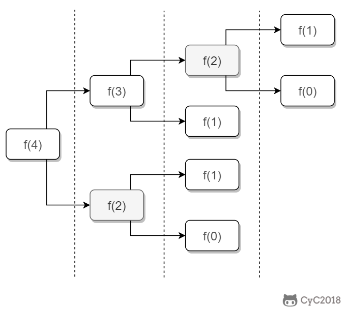

# 10.1 斐波那契数列

[letcode](https://leetcode-cn.com/problems/fei-bo-na-qi-shu-lie-lcof/)

## 题目描述

求斐波那契数列的第 n 项，0 <= n <= 100


## 解题思路

如果使用递归求解，会重复计算一些子问题。例如，计算 f(4) 需要计算 f(3) 和 f(2)，计算 f(3) 需要计算 f(2) 和 f(1)，可以看到 f(2) 被重复计算了。



递归是将一个问题划分成多个子问题求解，动态规划也是如此，但是动态规划会把子问题的解缓存起来，从而避免重复求解子问题。按照此种思路求解， letcode 上的运行时间会超出限制。

```python
class Solution:
    def fib(self, n: int) -> int:
        if n < 2: return n
        res = [0, 1] + [None]*(n-1)
        def _helper(n):
            return res[n] if res[n] is not None else ( _helper(n-1) + _helper(n-2)) % 1000000007

        return _helper(n)
```

考虑到第 i 项只与第 i-1 和第 i-2 项有关，因此只需要存储前两项的值就能求解第 i 项，从而将空间复杂度由 O(N) 降低为 O(1)。

```python
class Solution:
    def fib(self, n: int) -> int:
        if n < 2: return n
        a, b = 0, 1
        for _ in range(2, n+1):
            a, b = b, (a+b)%1000000007
        return b
```

由于待求解的 n 不超过 100，因此可以将前 101 项的结果先进行计算，之后就能以 O(1) 时间复杂度得到第 n 项的值。

```python
class Solution:
    def __init__(self):
        self.res = [0, 1] + [0] * 99
        for i in range(2, 101):
            self.res[i] = ( self.res[i-1] + self.res[i-2] ) % 1000000007

    def fib(self, n: int) -> int:
        return self.res[n]
```
