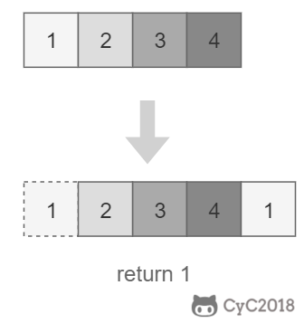

# 11. 旋转数组的最小数字

[leetcode](https://leetcode-cn.com/problems/xuan-zhuan-shu-zu-de-zui-xiao-shu-zi-lcof/)

## 题目描述

把一个数组最开始的若干个元素搬到数组的末尾，我们称之为数组的旋转。输入一个非递减排序的数组的一个旋转，输出旋转数组的最小元素。



### 解题思路

将旋转数组对半分可以得到一个包含最小元素的新旋转数组，以及一个非递减排序的数组。新的旋转数组的数组元素是原数组的一半，从而将问题规模减少了一半，这种折半性质的算法的时间复杂度为 $O(\lg N)$


此时问题的关键在于确定对半分得到的两个数组哪一个是旋转数组，哪一个是非递减数组。我们很容易知道非递减数组的第一个元素一定小于等于最后一个元素。

通过修改二分查找算法进行求解（$l$ 代表 $low$，$m$ 代表 $mid$，$h$ 代表 $high$）：

- 当 $nums[m] <= nums[h]$ 时，表示 $[m, h]$ 区间内的数组是非递减数组，$[l, m]$ 区间内的数组是旋转数组，此时令 $h = m$；
- 否则 $[m + 1, h]$ 区间内的数组是旋转数组，令 $l = m + 1$。

如果数组元素允许重复，会出现一个特殊的情况：$nums[l] == nums[m] == nums[h]$，此时无法确定解在哪个区间，需要切换到顺序查找。例如对于数组 ${1,1,1,0,1}，l、m$ 和 $h$ 指向的数都为 $1$，此时无法知道最小数字 $0$ 在哪个区间。

```python
class Solution:
    def minArray(self, numbers: List[int]) -> int:
        def findMini(left, right):
            for i in range(left, right):
                if numbers[i] > numbers[i+1]:
                    return numbers[i+1]
            return numbers[left]

        left,  right = 0, len(numbers)-1
        middle = left
        while numbers[left] >= numbers[right]:
            if right - left == 1:
                middle = right
                break

            middle = (left +  right) // 2
            if numbers[left] == numbers[middle] == numbers[right]:
                return findMini(left, right)

            if numbers[middle] >= numbers[left]:
                left = middle
            else:
                right = middle
        return numbers[middle]
```
