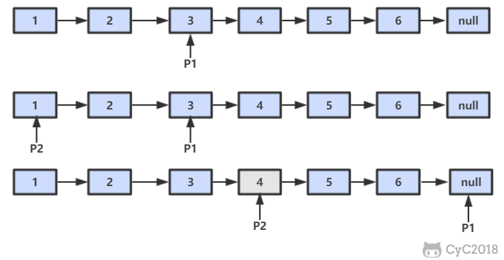

# 22. 链表中倒数第 K 个结点

[LeetCode](https://leetcode-cn.com/problems/lian-biao-zhong-dao-shu-di-kge-jie-dian-lcof/)

## 解题思路

设链表的长度为 N。设置两个指针 P1 和 P2，先让 P1 移动 K 个节点，则还有 N - K 个节点可以移动。此时让 P1 和 P2 同时移动，可以知道当 P1 移动到链表结尾时，P2 移动到第 N - K 个节点处，该位置就是倒数第 K 个节点。



```python
# Definition for singly-linked list.
# class ListNode:
#     def __init__(self, x):
#         self.val = x
#         self.next = None

class Solution:
    def getKthFromEnd(self, head: ListNode, k: int) -> ListNode:
        if head is None or k ==  0: return None
        fast, slow = head, head
        for _ in range(k):
            if fast is None:
                return None
            else:
                fast = fast.next
        while fast is not None:
            fast = fast.next
            slow = slow.next
        return slow
```

## 扩展：链表的中间节点

两个指针，从头部出发，一个指针 $A$ 一次走两步，一个指针 $B$ 一次走一步。当 $A$ 走到链表的结尾时，则 $B$ 指向的即为中间节点

```python
class ListNode:
    def __init__(self, x):
        self.val = x
        self.next = None


def find_middle_node(head: ListNode)  -> ListNode:
    """
    找出链表的中间节点并返回
    """
    if head is None: return None
    fast, slow = head, head
    while True:
        if fast.next is None or fast.next.next is None:
            return slow
        else:
            fast = fast.next.next
            slow = slow.next

if __name__ == "__main__":
    list_nodes =[ListNode(i) for i in range(1, 8)]
    for index in range(len(list_nodes) - 1):
        list_nodes[index].next = list_nodes[index+1]

    print(find_middle_node(list_nodes[0]).val)
```
