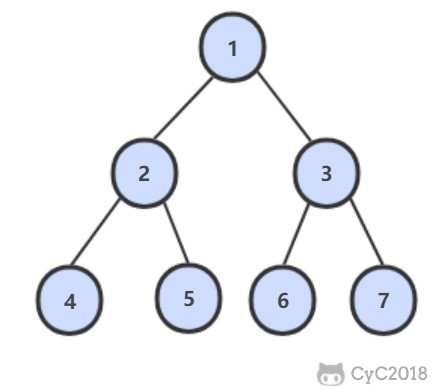

# 32. 从上至下打印二叉树

## 32.1 从上往下打印二叉树

[LeetCode](https://leetcode-cn.com/problems/cong-shang-dao-xia-da-yin-er-cha-shu-lcof/)

### 题目描述

从上往下打印出二叉树的每个节点，同层节点从左至右打印。

例如，以下二叉树层次遍历的结果为：1,2,3,4,5,6,7



#### 解题思路

使用队列来进行层次遍历。

```python
# Definition for a binary tree node.
# class TreeNode:
#     def __init__(self, x):
#         self.val = x
#         self.left = None
#         self.right = None

from collections import deque


class Solution:
    def levelOrder(self, root: TreeNode) -> List[int]:
        if root is None: return []
        res = []
        dq = deque()
        dq.append(root)
        while dq:
            item = dq.popleft()
            res.append(item.val)
            if item.left is not None: dq.append(item.left)
            if item.right is not None: dq.append(item.right)
        return res
```

## 32.2 把二叉树打印成多行

[LeetCode](https://leetcode-cn.com/problems/cong-shang-dao-xia-da-yin-er-cha-shu-ii-lcof/)

### 题目描述

使用队列来进行层次遍历。

需要使用两个变量，一个变量用来指示当前层的节点数，另一个变量用来指示下一层的节点数

#### 解题思路

```java
ArrayList<ArrayList<Integer>> Print(TreeNode pRoot) {
    ArrayList<ArrayList<Integer>> ret = new ArrayList<>();
    Queue<TreeNode> queue = new LinkedList<>();
    queue.add(pRoot);
    while (!queue.isEmpty()) {
        ArrayList<Integer> list = new ArrayList<>();
        int cnt = queue.size();
        while (cnt-- > 0) {
            TreeNode node = queue.poll();
            if (node == null)
                continue;
            list.add(node.val);
            queue.add(node.left);
            queue.add(node.right);
        }
        if (list.size() != 0)
            ret.add(list);
    }
    return ret;
}
```

## 32.3 按之字形顺序打印二叉树

[LeetCode](https://leetcode-cn.com/problems/cong-shang-dao-xia-da-yin-er-cha-shu-iii-lcof/)

### 题目描述

请实现一个函数按照之字形打印二叉树，即第一行按照从左到右的顺序打印，第二层按照从右至左的顺序打印，第三行按照从左到右的顺序打印，其他行以此类推。

#### 解题思路

- 需要两个栈，一个栈先存储左子节点，再储存右子节点，另一个栈先存储右子节点，再储存左子节点。由此来控制是从左往 右打印，还是从右往左打印
- 在打印一个节点时，将其子节点保存到另外一个栈中
- 两个栈交替使用，一个栈的结点全部弹出后，再对另外一个栈进行操作

```python
# Definition for a binary tree node.
# class TreeNode:
#     def __init__(self, x):
#         self.val = x
#         self.left = None
#         self.right = None

from collections import deque


class Solution:
    def levelOrder(self, root: TreeNode) -> List[List[int]]:
        if root is None: return []
        stacks = [deque(), deque()]
        current_stack, next_stack = 0, 1
        res, res_level = [], []

        stacks[current_stack].append(root)
        while stacks[0] or stacks[1]:
            item = stacks[current_stack].pop()
            res_level.append(item.val)
            if current_stack == 0:
                if item.left is not None: stacks[next_stack].append(item.left)
                if item.right is not None: stacks[next_stack].append(item.right)
            else:
                if item.right is not None: stacks[next_stack].append(item.right)
                if item.left is not None: stacks[next_stack].append(item.left)
            if not stacks[current_stack]:
                current_stack, next_stack = next_stack, current_stack
                res.append(res_level)
                res_level = []
        return res
```
