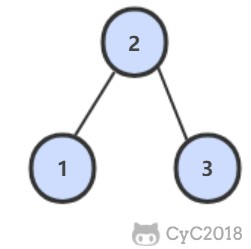

# 33. 二叉搜索树的后序遍历序列

[LeetCode](https://leetcode-cn.com/problems/er-cha-sou-suo-shu-de-hou-xu-bian-li-xu-lie-lcof/)

## 题目描述

输入一个整数数组，判断该数组是不是某二叉搜索树的后序遍历的结果。假设输入的数组的任意两个数字都互不相同。

例如，下图是后序遍历序列 1,3,2 所对应的二叉搜索树。



### 解题思路

根节点一定位于序列的最后，而左子树中的节点一定都不小于根节点，右子树中的节点一定都比不大于根结点，可以据此区分出数组中的左右子树。然后，可以通过判断右子树中节点的值是否都不小于根节点，来确定当前序列是否是二叉树的后续遍历序列

```python
class Solution:
    def verifyPostorder(self, postorder: List[int]) -> bool:
        def helper(start_index, end_index):
            if end_index - start_index <= 1:
                return True
            root = postorder[end_index]
            # 遍历到最后一个元素，防止只包含左子树的情况
            for i in range(start_index, end_index+1):
                if postorder[i] > root:
                    break
            for j in range(i, end_index):
                if postorder[j] < root:
                    return False
            return helper(start_index, i-1) and helper(i, end_index-1)
        # leetcode 测试用例中认为 [] 应返加 True
        if not postorder: return True  
        return helper(0, len(postorder)-1)
```
