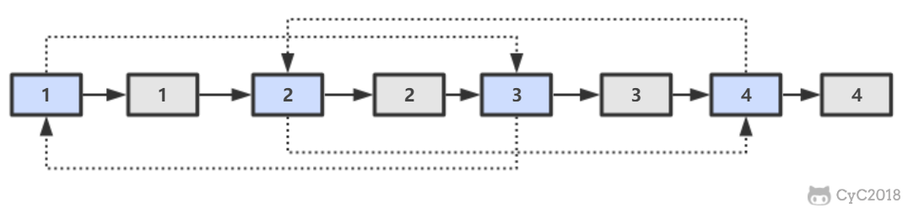
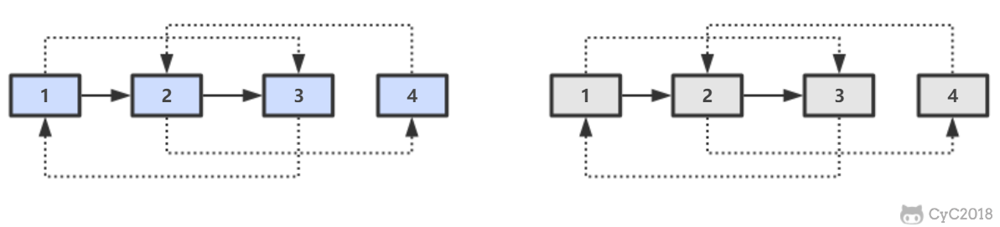

# 35. 复杂链表的复制

[LeetCode](https://leetcode-cn.com/problems/fu-za-lian-biao-de-fu-zhi-lcof/)

## 题目描述

输入一个复杂链表（每个节点中有节点值，以及两个指针，一个指向下一个节点，另一个特殊指针指向任意一个节点），返回结果为复制后复杂链表的 head。


### 解题思路

原地对节点进行复制，在不使用辅助空间的情况下，实现 $O(n)$ 的时间复杂度

第一步，在每个节点的后面插入复制的节点。



第二步，对复制节点的 random 链接进行赋值。


第三步，拆分。



```python
"""
# Definition for a Node.
class Node:
    def __init__(self, x: int, next: 'Node' = None, random: 'Node' = None):
        self.val = int(x)
        self.next = next
        self.random = random
"""
class Solution:
    def copyRandomList(self, head: 'Node') -> 'Node':
        if head is None: return None

        # 1. 插入新连接
        current_node = head
        while current_node is not None:
            clone_node = Node(current_node.val, current_node.next)
            current_node.next =  clone_node
            current_node = clone_node.next

        # 2. 建立 randon 连接
        current_node = head
        while current_node is not None:
            clone_node = current_node.next
            if current_node.random is None:
                clone_node.random = None
            else:
                clone_node.random = current_node.random.next
            current_node = clone_node.next

        # 3. 拆分出结果，同时保持原链表的结构不变
        current_clone_node = clone_head = head.next
        head.next = clone_head.next
        current_node = head.next
        while current_node is not None:
            current_clone_node.next = current_node.next
            current_node.next = current_node.next.next
            current_node = current_node.next
            current_clone_node = current_clone_node.next

        return clone_head
```
