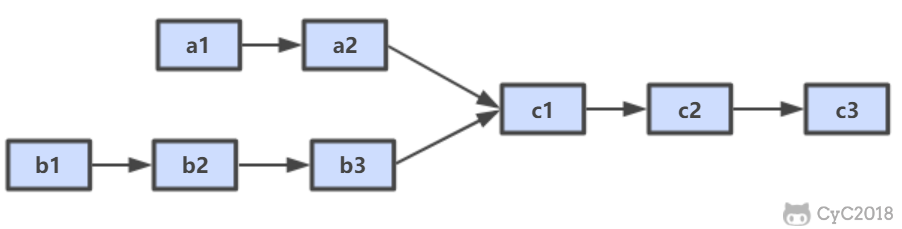

# 52. 两个链表的第一个公共结点

[LeetCode](https://leetcode-cn.com/problems/liang-ge-lian-biao-de-di-yi-ge-gong-gong-jie-dian-lcof/)

## 题目描述



公共结点为 c1

### 解题思路

设 A 的长度为 a + c，B 的长度为 b + c，其中 c 为尾部公共部分长度，可知 a + c + b = b + c + a。

当访问链表 A 的指针访问到链表尾部时，令它从链表 B 的头部重新开始访问链表 B；同样地，当访问链表 B 的指针访问到链表尾部时，令它从链表 A 的头部重新开始访问链表 A。这样就能控制访问 A 和 B 两个链表的指针能同时访问到交点。

```python
# Definition for singly-linked list.
# class ListNode:
#     def __init__(self, x):
#         self.val = x
#         self.next = None

class Solution:
    def getIntersectionNode(self, headA: ListNode, headB: ListNode) -> ListNode:
        if headA is None or headB is None: return None
        l1, l2 = headA, headB
        while(l1 != l2):
            l1 = l1.next if l1 is not None else headB
            l2 = l2.next if l2 is not None else headA
        return l1
```
