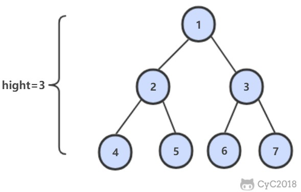

# 55.1 二叉树的深度

[LeetCode](https://leetcode-cn.com/problems/er-cha-shu-de-shen-du-lcof/)

## 题目描述

从根结点到叶结点依次经过的结点（含根、叶结点）形成树的一条路径，最长路径的长度为树的深度。



### 解题思路

分治法，分别求得左右子树的最大深度，即可得到整棵树的最大深度
具体可通过递归来实现

```python
# Definition for a binary tree node.
# class TreeNode:
#     def __init__(self, x):
#         self.val = x
#         self.left = None
#         self.right = None

class Solution:
    def maxDepth(self, root: TreeNode) -> int:
        return 0 if root is None else \
            max(self.maxDepth(root.left), self.maxDepth(root.right)) + 1
```
