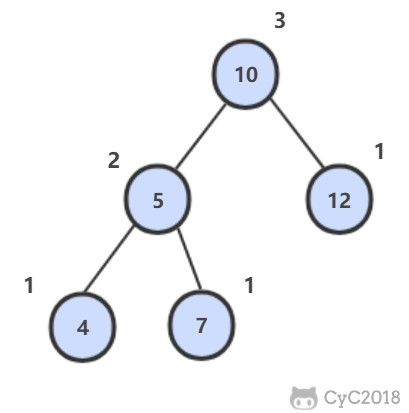

# 55.2 平衡二叉树

[LeetCode](https://leetcode-cn.com/problems/ping-heng-er-cha-shu-lcof/)

## 题目描述

平衡二叉树左右子树高度差不超过 1。



### 解题思路

平衡二叉树的子树仍然为平衡二叉树，可以借此分别验证其左右子树是否为平衡二叉树，最后再验证整棵对是否为平衡二叉树

具体可通过递归来实现，递归函数返回以当前节点为根节点的树的高度，以便于后续判断

```python
# Definition for a binary tree node.
# class TreeNode:
#     def __init__(self, x):
#         self.val = x
#         self.left = None
#         self.right = None


class Solution:
    def isBalanced(self, root: TreeNode) -> bool:
        self.is_balanced = True
        self.height(root)
        return self.is_balanced

    def height(self, root):
        if root is None or not self.is_balanced:
            return 0
        left = self.height(root.left)
        right = self.height(root.right)
        if abs(left - right) > 1:
            self.is_balanced = False
        return max(left, right) + 1

```
