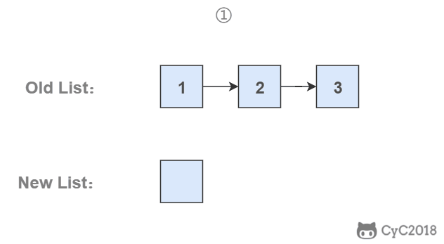

# 6. 从尾到头打印链表

[LetCode](https://leetcode-cn.com/problems/cong-wei-dao-tou-da-yin-lian-biao-lcof/)

## 题目描述

从尾到头反过来打印出每个结点的值。


## 解题思路

### 使用递归

要逆序打印链表 1->2->3（3,2,1)，可以先逆序打印链表 2->3(3,2)，最后再打印第一个节点 1。而链表 2->3 可以看成一个新的链表，要逆序打印该链表可以继续使用求解函数，也就是在求解函数中调用自己，这就是递归函数。

当链表的长度非常长时，会导致函数调用的层级很深，从而可能导致函数调用栈溢出

```python
# Definition for singly-linked list.
# class ListNode:
#     def __init__(self, x):
#         self.val = x
#         self.next = None

class Solution:
    def reversePrint(self, head: ListNode) -> List[int]:
        res = []
        def _helper(head):
            if head is not None:
                _helper(head.next)
                res.append(head.val)

        _helper(head)
        return res
```

### 使用头插法

使用头插法可以得到一个逆序的链表。

头结点和第一个节点的区别：

- 头结点是在头插法中使用的一个额外节点，这个节点不存储值；
- 第一个节点就是链表的第一个真正存储值的节点。



```python
# Definition for singly-linked list.
# class ListNode:
#     def __init__(self, x):
#         self.val = x
#         self.next = None

class Solution:
    def reversePrint(self, head: ListNode) -> List[int]:
        null_head = ListNode(None)
        while head is not None:
            tmp = head.next
            head.next = null_head.next
            null_head.next = head
            head = tmp
        head = null_head.next
        res = []
        while head is not None:
            res.append(head.val)
            head = head.next
        return res
```

### 使用栈

栈具有后进先出的特点，在遍历链表时将值按顺序放入栈中，最后出栈的顺序即为逆序。


```python
# Definition for singly-linked list.
# class ListNode:
#     def __init__(self, x):
#         self.val = x
#         self.next = None

from collections import deque

class Solution:
    def reversePrint(self, head: ListNode) -> List[int]:
        dq = deque()
        while head is not None:
            dq.append(head.val)
            head = head.next
        res = []
        while dq:
            res.append(dq.pop())
        return res
```
