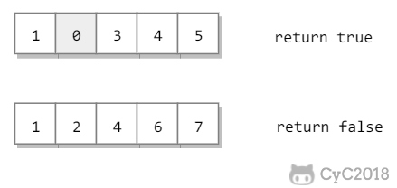

# 61. 扑克牌顺子

[LeetCode](https://leetcode-cn.com/problems/bu-ke-pai-zhong-de-shun-zi-lcof/)

## 题目描述

五张牌，其中大小鬼为癞子，牌面为 0。判断这五张牌是否能组成顺子。



### 解题思路

```python
class Solution:
    def isStraight(self, nums: List[int]) -> bool:
        if len(nums) < 5: return False
        nums = sorted(nums)
        count = 0
        for i in range(len(nums)):
            if nums[i] == 0:
                count += 1
            elif i > 0 and nums[i-1] != 0:
                if nums[i] == nums[i-1]:
                    return False
                elif nums[i] != nums[i-1] + 1:
                    count -= nums[i] - nums[i-1] - 1
                    if count < 0:
                        return False
        return True
```
