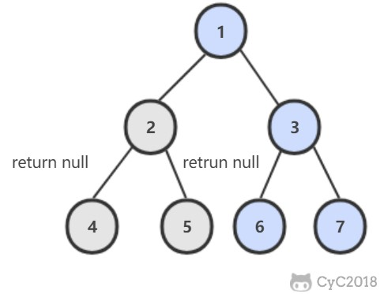

# 68. 树中两个节点的最低公共祖先

## 二叉查找树

[Leetcode](https://leetcode-cn.com/problems/er-cha-sou-suo-shu-de-zui-jin-gong-gong-zu-xian-lcof/)

二叉查找树中，两个节点 p, q 的公共祖先 root 满足 root.val >= p.val && root.val <= q.val。


```python
# Definition for a binary tree node.
# class TreeNode:
#     def __init__(self, x):
#         self.val = x
#         self.left = None
#         self.right = None

class Solution:
    def lowestCommonAncestor(self, root: 'TreeNode', p: 'TreeNode', q: 'TreeNode') -> 'TreeNode':
        if p.val > q.val:
            p, q = q, p
        while root is not None:
            if  p.val <= root.val <= q.val:
                return root
            elif root.val > q.val:
                root = root.left
            else:
                root = root.right
        return root
```

## 普通二叉树

[LeetCode](https://leetcode-cn.com/problems/er-cha-shu-de-zui-jin-gong-gong-zu-xian-lcof/)

在左右子树中查找是否存在 p 或者 q，如果 p 和 q 分别在两个子树中，那么就说明根节点就是最低公共祖先。



```python
# Definition for a binary tree node.
# class TreeNode:
#     def __init__(self, x):
#         self.val = x
#         self.left = None
#         self.right = None


class Solution:
    def lowestCommonAncestor(self, root: TreeNode, p: TreeNode, q: TreeNode) -> TreeNode:
        if root is None or root == p or root == q:
            return root
        left = self.lowestCommonAncestor(root.left, p, q)
        right = self.lowestCommonAncestor(root.right, p, q)
        if left is None:
            if right is None:
                return None
            else:
                return right
        else:
            if right is None:
                return left
            else:
                return root
```
