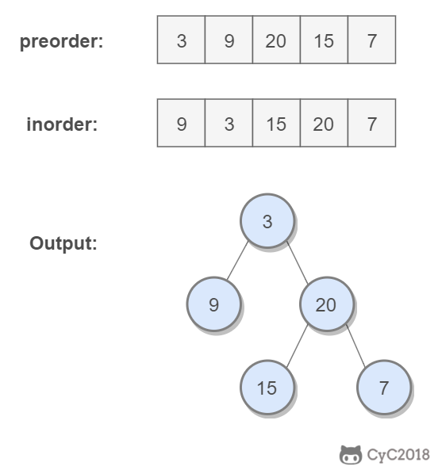
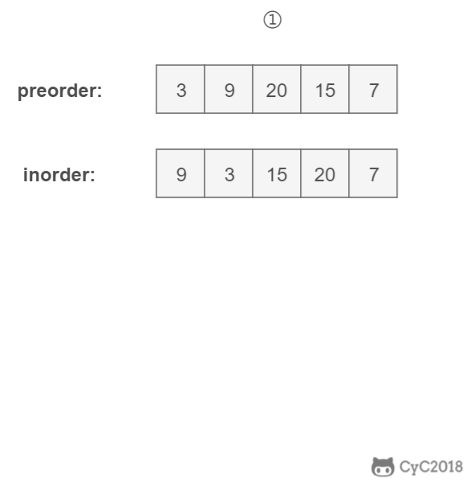

# 7. 重建二叉树

[letcode](https://leetcode-cn.com/problems/zhong-jian-er-cha-shu-lcof/)

## 题目描述

根据二叉树的前序遍历和中序遍历的结果，重建出该二叉树。假设输入的前序遍历和中序遍历的结果中都不含重复的数字。



## 解题思路

前序遍历的第一个值为根节点的值，使用这个值将中序遍历结果分成两部分，左部分为树的左子树中序遍历结果，右部分为树的右子树中序遍历的结果。

由此可将前序遍历的数组分为左子树和右子树，相当于是原问题的子问题，通过递归即可解决。体现了分治法的思想。



```python
# Definition for a binary tree node.
# class TreeNode:
#     def __init__(self, x):
#         self.val = x
#         self.left = None
#         self.right = None

class Solution:
    def buildTree(self, preorder: List[int], inorder: List[int]) -> TreeNode:
        inorder_dict = {}
        for index, item in enumerate(inorder):
            inorder_dict[item] = index

        def _helper(preorderL, preorderR,  inorderL):
            if preorderL > preorderR: return None
            root = TreeNode(preorder[preorderL])
            inorder_index = inorder_dict[root.val]
            left_tree_size = inorder_index - inorderL
            root.left = _helper(preorderL+1, preorderL+left_tree_size, inorderL)
            root.right = _helper(preorderL+left_tree_size+1, preorderR,
            inorderL + left_tree_size + 1)
            return root

        return _helper(0, len(preorder)-1, 0)
```
